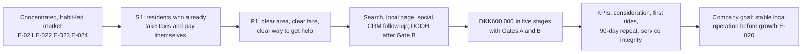

# Integrated marketing plan: Green SM in Copenhagen — v01, approved (D-033)

Prepared 28 September 2026. **Status: approved by the group on 28 September 2026 (D-033), as relayed by the student; approvals A1–A9 in §13 accepted as proposed.** Earlier decisions: Copenhagen, app-booked electric taxi rides (D-031); segment S1, positioning P1, DKK600,000 over 12 months with a market-entry objective (D-032). Targets and funnel rates remain planning assumptions. **Age-scope amendment, 3 October 2026 (D-043):** the student approved ages **25–44** within S1; this supersedes the earlier 18+/no-age-cut-off proposal below. Budget/KPI values are unchanged, and the funnel has not been revalidated for the narrower range. This is plan content, not poster copy: P5 compresses it into the eleven panels.

**Conventions.** E-numbers point to `02_research/evidence-log.md`; each has a saved, verified PDF and a page. Backticked IDs are module concepts in `03_course_materials/concept-register.md`, quoted there with slide locators. **F** = sourced fact; **P** = proposal; **A** = assumption; **U** = unknown that the plan must not hide. Money is DKK, excluding VAT, for M1–M12 (start date not yet set).

## 1. The argument in one chain

Copenhagen's taxi market is concentrated and habitual: Uber and Dantaxi together held a 40–50% revenue share in Greater Copenhagen (E-022); among recent taxi users surveyed, 40–50% had one taxi app installed and 30–40% none (E-023); and the competition authority judged that becoming known to customers and drivers would need significant marketing investment (E-021). In a Capital Region subsample of riders who had chosen a platform app (n = 79), price was the main reason (57%), then habit (22%), shorter waits and ease of use (18% each) (E-024). Electric cars are ordinary in Denmark (68.5% of new cars in 2025 were battery-electric, E-039), so "electric" alone does not set Green SM apart.

Green SM's controllable difference is its operating model: it owns its Copenhagen fleet and employs its drivers (E-008, E-019, E-011), and its published day fare for a standard trip is in line with an established competitor's (E-015, E-028). The plan therefore targets residents who already take taxis (S1) and positions Green SM as the local taxi that is **easy to judge before booking and easy to get help from afterwards** (P1). The budget buys awareness and first trips, but money is released in stages and stops if service quality, conversion or repeat use fall short. That protects the company's own stated priority of stable local operation before rapid growth (E-020).

## 2. Student/Business Details

- Group: 001545326 Nguyen Phi Giao; 001545344 Le Quoc Khoi; 001545423 Nguyen Ho Khanh Vy (`01_context/group-roster.md`).
- Business: Green SM (GSM Green and Smart Mobility Joint Stock Company), Vietnam; plan scope: Green SM Denmark ApS's app-booked electric taxi service in Copenhagen.
- **U:** each member's actual contribution and speaking role (Q-S5). Nothing is written here until the group supplies it.

## 3. Company/Business Introduction

Concepts: `drivers-of-change` (w01-lecture s20), `platform-business-model` (w01-lecture s19), `customer-experience-differentiator` (w01-lecture s17).

- **F — origin and growth:** GSM's founding was announced on 6 March 2023 (E-001); its Xanh SM taxi service launched in Hanoi on 14 April 2023 (E-002). The brand became Green SM on 13 April 2026 (E-010). As at 26 September 2026 it counts eight markets, including a pilot in the Netherlands (E-009).
- **F — Denmark:** launched in Copenhagen on 30 July 2026 as Green SM's first European market (E-008, E-017), with taxi sales from 27 July (E-019). Green SM Denmark ApS is a nationally licensed dispatch office (E-027). It owns and runs its fleet and employs its drivers on hourly pay under a collective agreement in the initial phase (E-008, E-011, E-019).
- **F — service footprint:** at launch the service covered only Inner Copenhagen, 08:00–20:00 (E-182). Uber told the authority that by 17 August it covered all of Copenhagen, around the clock Thursday–Saturday (E-183) — a competitor's claim. **U:** current area and hours; they must be rechecked before any campaign promise.
- **F — country context:** Copenhagen municipality had 670,389 residents on 1 July 2026 (E-031); 44.3% of households are one person (E-033); 1,375 taxis were registered there on 1 January 2026 (E-034). Taxis are a small mode: 0.1% of national person-kilometres in 2024 (E-036). Digital payment is the norm: 91% of in-store transactions (E-044).
- **Why it matters:** Uber and Bolt run platform models that book trips performed by other operators (E-184; `platform-business-model`). Green SM runs the service itself. Today's customers expect transparency (`customer-experience-differentiator`), and the operating model is what could make that promise deliverable.

## 4. Target Market Analysis

Concepts: `market-segmentation` and `stp-model` (w04-lecture s7), `segmentation-bases` (w04-tutorial s5), `targeting` (w04-lecture s7), `targeting-strategies` (w04-tutorial s5), `consumer-decision-making-process` (w03-lecture s5).

**Priority segment S1 (decided, D-032):** adults living in Green SM's confirmed Copenhagen service area who already take a taxi for some recurring trips and pay for it themselves.

| Base | What we know (F) or propose (P) | Why it matters for the plan |
|---|---|---|
| Geographic | F: Copenhagen municipality, 670,389 residents (E-031); service area grew from Inner Copenhagen (E-182). P: target only the confirmed area and hours. | Advertising outside the area wastes money and breaks the P1 promise. |
| Demographic | F: 44.3% one-person households (E-033); mean disposable income DKK295,836 (E-032). P: adults 18+, no age or income cut-off. | City averages describe context, not individual riders; no age band is supported by evidence. |
| Behavioural | F: among recent taxi users, 40–50% had one taxi app and 30–40% none (E-023); in the Capital Region subsample (n = 79), price (57%) and habit (22%) led app choice (E-024). P: focus on occasions people already take taxis for (examples to validate: late evening, luggage, bad weather, recurring appointments). | Adoption means breaking a habit: the first trip must be easy to try and the second easy to repeat. |
| Psychographic | F: 77% of Danes report personal climate action and 41% use alternatives to the private car (E-038). A (hypothesis): S1 values predictability and being treated fairly when something goes wrong more than a green message. | Climate concern is widespread but not a reason to switch taxi apps; the hypothesis is tested through the clarity score and Gate A (§10). |

**Targeting choice:** concentrated marketing (`targeting-strategies`). S2 (organisations buying trips) and S3 (short-stay visitors) are not targeted. S2 needs account invoicing that is not evidenced in Denmark; S3 rides rarely repeat and depend on hotel partners. Organic bookings from them are still welcome.

**Journey (`consumer-decision-making-process`):** need (a taxi occasion) → search ("taxa København") → evaluation (price, wait, whether the app is already installed) → first booking → post-trip judgement. The plan puts one tactic at each stage (§7).

**Optional, for group decision (§13, A8):** an illustrative persona (`customer-personas`, w04-tutorial s4) for the poster, e.g. "a Copenhagen resident who lives alone, takes a taxi a few times a month, uses one app out of habit and checks the price first". Its details are a composite of E-023/E-024/E-033, **not an observed person**; it must be labelled as such or left out.

## 5. Positioning Strategy

Concepts: `positioning` and `unique-value-proposition` (w04-lecture s7), `positioning-strategies` (w04-tutorial s5), `positioning-statement` (w06-lecture s5).

**Positioning statement (P1, proposed wording):**

> For Copenhagen residents who already take taxis for everyday trips, Green SM is the locally run electric taxi that is easy to judge before you book — clear service area, clear fare terms — and easy to get help from afterwards, because Green SM owns its cars and employs its drivers in Copenhagen.

- **Benefit positioning:** confidence before and after the trip (the UVP). **Attribute positioning:** owned fleet, employed drivers, licensed local dispatch office (E-019, E-011, E-027). **Not competitor positioning:** we have no evidence that Uber, Bolt or TAXA are less clear or less helpful, so the poster must not claim it.
- **Price is handled honestly:** on the same standard 10 km/12-minute weekday trip, Green SM's published day meter works out at DKK227 (E-015) and TAXA 4x35 displays DKK230 (E-028). That is parity, not price leadership. App prices can reach separate published maxima (E-015), so the promise is *clear fare terms*, not *cheaper*.
- **Electric is supporting proof, not the headline:** with 68.5% of new Danish cars battery-electric (E-039), "green taxi" does not differentiate. The Danish site's own wording, "zero tailpipe emissions" (E-013), may be used; lifecycle or "carbon-free" claims may not.

| Observable fact | Green SM | Uber (with Dantaxi/Drivr) | Bolt | TAXA 4x35 |
|---|---|---|---|---|
| How trips are supplied | Own fleet, employed drivers (E-019) | App booking trips run by Drivr and Dantaxi (E-184) | App booking trips run by Viggo and Taxa 4x27 (E-184) | U |
| Standard 10 km/12 min weekday price | DKK227, published day meter (E-015) | U | U | DKK230 displayed (E-028) |
| Market position | New entrant, sales since 27 July 2026 (E-019) | With Dantaxi 40–50% revenue share; divestment ordered (E-022, E-025) | U | U |

**Proof the plan must create (not claim):** the help route works (complaint response standard met, §10) and riders say the terms were clear (post-trip survey). If riders see no difference from their current app after M1–M4, P1 is revised at Gate A.

## 6. Branding and Identity

Concepts: `brand-identity` and `brand-strategy-alignment` (w04-lecture s8), `brand-identity-components` and `consistent-brand-messaging` (w04-tutorial s6).

- **Keep the existing identity (F):** the Green SM name and logo — a leaf-shaped "V" mark in teal and yellow-gold with the wordmark GREEN SM — as seen on the Danish site (rendered page, `green-sm-denmark-aps-ndc` p. 1; colours described, no official colour codes invented). Danish core values: "Safety - Discipline - Reliability - Professionalism - Local Respect" (E-012); mission "Provide a green, convenient, and sustainable mobility solution." (E-185).
- **P — campaign message for S1:** primary line **"Know your ride before you book."** Support line: *"Clear area. Clear fare. A clear way to get help — from Copenhagen's locally run electric taxi."* It turns the values "Reliability" and "Local Respect" into a promise S1 can check.
- **P — language:** Danish first, English second for residents who do not use Danish (A: the size of this group is not measured). Localisation sits in the creative hours (§9).
- **P — consistency:** the same line, trip-reference format and help instructions on the landing page, ads, app messages, in-car card and DOOH (`consistent-brand-messaging`).
- **Emotional link (`brand-strategy-alignment`):** the feeling sold is *being in control of the trip* — suited to people who ride occasionally and dislike surprises. This is a hypothesis to test, not a proven insight.

## 7. Digital Marketing Tactics

Concepts: `consumer-decision-making-process` (w03-lecture s5), `pay-per-click` (w02-lecture s11), `search-engine-optimisation` (w02-lecture s10), `content-marketing` (w02-lecture s7), `social-media-marketing` (w02-lecture s6), `email-marketing` (w02-lecture s9), `customer-engagement-and-support` (w02-lecture s12), `integrated-digital-marketing` (w02-lecture s14).

| Journey stage | Tactic (P) | Why this tactic for S1 | Budget line |
|---|---|---|---|
| Need / search | **Paid search** on Copenhagen taxi-intent terms (Danish and English), geo-fenced to the confirmed area and hours | People already looking for a taxi are the cheapest to convert; many recent taxi users have one taxi app or none (E-023), so capturing the moment of need matters | Paid search DKK108,000 |
| Information search | **Local landing page + SEO:** map of the service area, hours, how the meter and app price work, how to get help with a trip reference | Delivers P1 directly; answers the price question that drives 57% of choices (E-024) | Creative 120 h (localisation, page) |
| Evaluation | **Paid social explainers** (short videos: "how the fare works", "how to get help with a trip") to Copenhagen adults in the area; frequency-capped | Social media user identities equal 78.9% of the Danish population (E-042); explainers build trust in a new name | Paid social DKK90,000 |
| Purchase | App booking with a **DKK30 first-ride voucher**, one per new rider, capped at 400 riders | A small, capped push over the habit barrier (E-024); the company's own launch promotion ends 30 September 2026 (E-181) | Incentive reserve DKK12,000 |
| Post-purchase | **Opted-in follow-up** after the first trip: trip reference, help route, one relevant reminder (e.g. pre-book a recurring trip, a feature the app already offers, E-016) | Turns a first trip into a second; builds the retention the plan depends on (`email-marketing`, `customer-engagement-and-support`) | CRM 120 h; tools DKK30,000 |
| Awareness (market entry) | **Digital Copenhagen DOOH**, 200,000 impressions at DKK191 CPM + DKK4,995 setup (E-029), **only after Gate B** | Supports the market-entry objective once service and repeat use are proven; no conversions are credited to it | DOOH DKK43,195 |

**Integration (`integrated-digital-marketing`):** one message, one landing page, one trip-reference format across every channel; search and social send traffic to the same page, so results can be compared.

**Not chosen, with reason:** influencer marketing (no evidence that S1 follows taxi-related influencers; cost unknown); broad bus-shelter posters (DKK174,616 for one week, E-030 — too costly for a gated plan); visitor/airport campaigns (S3 not targeted).

## 8. Sales Strategies

Concepts: `sales-process` (w04-lecture s9), `sales-channels` (w04-lecture s9), `selling-techniques` (w04-tutorial s7), `closing-techniques` and `soft-selling` (w04-lecture s11), `after-sales-service` (w04-tutorial s7), `relationship-selling` (w05-lecture s8), `crm` (w01-lecture s16).

For a consumer taxi service the "sale" is a completed, paid trip. The module's sales process maps onto it:

1. **Lead generation:** search, social and (later) DOOH bring S1 residents to the landing page. A lead is an app install or a registered account, not yet a sale.
2. **Prospecting:** installers who have not ridden receive one opted-in message explaining the service area and help route — a relationship move, not a hard sell.
3. **Conversion / closing:** the capped DKK30 first-ride voucher is the incentive-based close (`closing-techniques`); there is no false urgency.
4. **After-sales service:** every trip has a reference number; problems go to a staffed help route; the follow-up asks one question about clarity (`after-sales-service`).
5. **Relationship selling:** personalised reminders for a rider's recurring trips (with consent) and pre-booking up to 30 days ahead (E-016) encourage the second and third trips (`relationship-selling`).

**Selling techniques (`selling-techniques`):** *value-based selling* — show the fare terms and what help is available, rather than competing on discounts; *personalised offers* — reminders based on the rider's own trip pattern, not bought data. **Soft selling (`soft-selling`):** after a resolved or well-rated trip, invite (never pay for) an app-store review. **Channel (`sales-channels`):** direct to consumer through Green SM's own app and site, which keeps the customer relationship and data in-house.

**Drivers as the front line (P):** drivers are Green SM employees (E-011), so a short briefing and an in-car card with the help route and trip-reference format can be introduced. Card design sits in the creative hours; printing needs a quote and would come from contingency only if approved (§13, A9).

**Prerequisite (U):** the help route needs frontline support staff. That is an operating cost outside this marketing budget; the plan funds only the CRM handover and follow-up (120 h). If the company cannot staff it, P1 cannot be promised.

## 9. Budget and Resource Allocation

Concepts: `budget-and-resource-allocation` (w04-lecture s10), `marketing-budget-line-items` (w04-tutorial s8), `customer-acquisition-cost` (w04-tutorial s10).

**Total DKK600,000 over 12 months (decided, D-032). Line items are proposals (§13, A1).** Professional time is costed at an assumed DKK600/hour (A). Media prices: DOOH from the published rate card (E-029); search and social are budget envelopes, not quotes.

| Line item | DKK | Share | Basis |
|---|---:|---:|---|
| Research and service validation (60 h) | 36,000 | 6.00% | A: hours × DKK600 |
| Creative production and localisation (120 h) | 72,000 | 12.00% | A |
| Campaign management and optimisation (160 h) | 96,000 | 16.00% | A |
| CRM and customer-support handover (120 h) | 72,000 | 12.00% | A |
| Paid search | 108,000 | 18.00% | P: envelope |
| Paid social | 90,000 | 15.00% | P: envelope |
| Digital Copenhagen DOOH (200,000 impressions) | 38,200 | 6.37% | F: CPM DKK191 (E-029) |
| DOOH setup | 4,995 | 0.83% | F: E-029 |
| Analytics/CRM tools (12 × DKK2,500) | 30,000 | 5.00% | A |
| First-ride incentive reserve (400 × DKK30) | 12,000 | 2.00% | P |
| Uncommitted contingency | 40,805 | 6.80% | Residual; released only with approval |
| **Total** | **600,000** | **100.00%** | |

**Staged release (P, §13 A2).** Money is released in five stages; the two gates decide whether the rest is spent.

| Line item (DKK) | M1–M2 build | M3–M4 test | M5–M6 | M7–M9 | M10–M12 |
|---|---:|---:|---:|---:|---:|
| Research and service validation | 30,000 | 3,000 | 0 | 0 | 3,000 |
| Creative production and localisation | 36,000 | 6,000 | 6,000 | 18,000 | 6,000 |
| Campaign management and optimisation | 12,000 | 18,000 | 18,000 | 27,000 | 21,000 |
| CRM and customer-support handover | 18,000 | 9,000 | 12,000 | 18,000 | 15,000 |
| Paid search | 0 | 18,000 | 24,000 | 36,000 | 30,000 |
| Paid social | 0 | 15,000 | 20,000 | 30,000 | 25,000 |
| DOOH incl. setup | 0 | 0 | 0 | 43,195 | 0 |
| Analytics/CRM tools | 5,000 | 5,000 | 5,000 | 7,500 | 7,500 |
| First-ride incentive reserve | 0 | 2,000 | 3,000 | 4,000 | 3,000 |
| **Stage total** | **101,000** | **76,000** | **88,000** | **183,695** | **110,500** |

Stage totals sum to DKK559,195; with the DKK40,805 contingency the plan totals DKK600,000. **Committed before Gate A: DKK177,000 (29.5%). Before Gate B: DKK265,000 (44.2%).**

**Resources (P):** 460 professional hours across four company roles — research/analytics, creative/localisation, campaign manager, CRM/support coordinator. These are Green SM roles, not group members' work. Vehicles, drivers, charging and frontline support are operating costs outside this budget.

**Financial honesty (for the poster and Q&A):** under the plan's own assumptions the programme does not pay for itself in year one. At the illustrative case it produces about 378 first riders and 676 rides; at an assumed 30% contribution that leaves about DKK554,000 of the DKK600,000 uncovered, and break-even would need 8,811 rides (`budget-kpi-scenarios.md`). Paid media cost about DKK524 per first rider (paid acquisition only, not full CAC). The case for spending is market entry — the authority says a newcomer needs significant marketing to become known (E-021) — and the gates cap the loss if the evidence goes the wrong way. No lifetime value is claimed.

## 10. Measurement and Evaluation

Concepts: `kpis-and-metrics` and `campaign-tracking-and-analytics` (w04-lecture s12), `sales-conversion-rate`, `customer-acquisition-cost`, `customer-retention-rate` and `customer-satisfaction-csat` (w04-tutorial s10), `click-through-rate` and `cost-per-click` (w02-mini-case-studies p. 2).

**Marketing objectives (P, §13 A6):**

- **O1 Awareness:** raise consideration of Green SM among S1 in the service area by 10 percentage points between the M1–M2 baseline and M12 (proposed target, D-034).
- **O2 Trial:** 378 new riders complete a first paid trip in M1–M12.
- **O3 Repeat:** at least 35% of first riders with a full 90-day window take another paid trip within 90 days.
- **O4 Service integrity:** the promise in P1 is kept while volume grows.

| KPI | Definition | Proposed target (A) | Tool and rhythm | If off target |
|---|---|---|---|---|
| Brand consideration (O1) | % of an S1 survey sample in the area who would consider Green SM for their next taxi trip | +10 percentage points on the M1–M2 baseline by M12 (A, D-034); no invented starting figure | Short panel survey, M1–M2 and M12 | Revisit message and DOOH before year 2 |
| First paid riders (O2) | New riders completing and paying for a first trip | 378 over M1–M12 | Booking/settlement data, weekly | Below plan at Gate A: fix page/offer before more spend |
| Paid conversion (O2) | First paid riders ÷ all recorded paid clicks, by channel | Search 3%, social 1.5% | Ad platforms + booking data, weekly | Below 1.5% / 0.8% at Gate A: pause the channel |
| Paid cost per first rider (O2) | Search + social spend ÷ first paid riders | ≤ DKK524 | Finance + booking data, monthly | Above DKK1,829 at Gate B: stop media |
| 90-day repeat rate (O3) | First riders with another paid trip within 90 days ÷ first riders with a full window | ≥ 35% | Cohort report, monthly from M6 | Below 20% at Gate B: stop DOOH and scale-up |
| Completion (O4) | Completed ÷ accepted bookings | ≥ 95% | Dispatch data, daily | Pause acquisition in affected areas |
| Service-caused cancellations (O4) | Cancellations caused by Green SM ÷ accepted bookings | ≤ 2% | Dispatch reason codes, daily | Pause acquisition in affected areas |
| Available offer rate (O4) | In-area requests that receive a usable offer ÷ all in-area requests | Set after baseline | Request logs, weekly | Do not advertise hours/areas that fail |
| Help-route response (O4, P1 proof) | Complaints with a trip reference answered within 24 hours | ≥ 90% (A, D-034); confirm with operations in M1–M2 | Support log, weekly | P1 cannot be advertised until met |
| Clarity score (P1 proof) | Post-trip question: "Were the area and fare terms clear?" | ≥ 80% answer yes (A, D-034) | In-app survey, monthly | Rewrite page and messages |
| Spend control | Committed + spent vs stage budget | Within stage totals | Finance, weekly | Contingency only with approval |

**Gates (P, §13 A2):**

- **Gate A — end of M4:** completion ≥95% and service-caused cancellations ≤2% on an agreed minimum volume; help-route standard met; paid conversion at least 1.5% (search) and 0.8% (social). Pass → release M5–M6. Fail → hold media, fix the cause, re-test; maximum exposure DKK177,000.
- **Gate B — end of M6:** riders whose first trip was in M3 and who have completed 90 days repeat at ≥20%, and paid cost per first rider is ≤ DKK1,829, to continue; repeat ≥35% releases DOOH. Fail → stop scale-up; maximum exposure DKK265,000.
- **M12 review:** renew, revise or stop for year 2 against O1–O4.

The gate floors are the plan's downside assumptions and the targets are its illustrative assumptions (`budget-kpi-scenarios.md` §3): they are planning hypotheses, not Green SM data or industry benchmarks. Counting rules: installs are not riders; immature cohorts are excluded from repeat rates; refunds are removed.

## 11. Creativity and Innovation

Concepts: `personalisation` (w01-lecture s15), `omnichannel` (w01-lecture s13), `artificial-intelligence` (w01-lecture s15), `subscription-model` (w05-lecture s3), `subscription-challenges` (w05-lecture s9), `usage-based-model` (w05-tutorial s5), `neuromarketing` (w03-lecture s10).

**Adopted (P, §13 A7):**

- **Personalisation — "your usual trip":** with the rider's consent, the app reminds them before a trip they take regularly and offers pre-booking (an existing feature, E-016), in their chosen language (Danish or English). It uses only the rider's own trip history, never bought data or inferred sensitive traits. It serves O3 directly.
- **Omnichannel — one trip reference everywhere:** the same reference and help instructions on the landing page, app, in-car card, follow-up message and support. The rider never has to explain the trip twice. This is how P1's "clear way to get help" is delivered.

**Considered and deferred, with reasons:**

- **AI chatbot:** an automated assistant that gets a fare or refund wrong would break P1. Test only after a human-run FAQ has shown which questions come up.
- **Subscription:** a monthly fee needs frequent riders; the plan models about 1.8 rides per first rider within the window. The module warns about price sensitivity and billing complexity (`subscription-challenges`). Green SM sells membership packages in Vietnam (E-160), but none is evidenced in Denmark. Pay-per-trip (`usage-based-model`) stays.
- **Neuromarketing:** no biometric or subconscious testing; ordinary surveys measure clarity.

**Originality claim:** the new element is not a technology but a promise that can be checked — every trip has a reference and a route to a person — used as the brand's entry story.

## 12. Alignment with Business Objectives

Concepts: `alignment-with-objectives` (w06-lecture s7), `long-term-sustainable-growth` (w01-lecture s9), `retention-over-acquisition` (w05-lecture s8).

| Business objective (source) | Marketing objective | How the plan serves it |
|---|---|---|
| Stable local operation before rapid expansion (E-020) | O4 service integrity; gates | Spend rises only when completion, cancellations and help-route standards hold |
| Become known in a concentrated market (authority view, E-021) | O1 awareness, O2 trial | Search/social first; DOOH only once the service is proven |
| Green, convenient, sustainable mobility (mission, E-185) | O2, O3 | Each repeat trip is a trip in an electric car; claims limited to "zero tailpipe emissions" (E-013) |
| Long-term sustainable growth (`long-term-sustainable-growth`) | O3 repeat | Retention is the scale test (`retention-over-acquisition`); year-one loss is capped, not hidden |

## 13. Approvals needed from the group

| ID | Decision | Agent's proposal | Alternative |
|---|---|---|---|
| A1 | Line items | Allocation in §9 | Move DOOH money into search/social, or cut DOOH and keep it as contingency |
| A2 | Staged release and gates | Five stages; Gate A (M4), Gate B (M6) | Spend evenly across 12 months (weaker defence of the DKK600,000) |
| A3 | Channel mix | Search, local page/SEO, social, CRM; DOOH after Gate B | Add influencers (cost unknown) or drop DOOH |
| A4 | Brand message | "Know your ride before you book." Danish first | Group's own line within P1 |
| A5 | First-ride incentive | DKK30, one per new rider, cap 400 | No incentive (weaker trial), or larger voucher (higher cost) |
| A6 | Objectives and KPI targets | O1–O4 and the targets in §10 | Different figures, if the group can justify them |
| A7 | Innovation | Personalised trip reminders + one trip reference everywhere; AI and subscription deferred | Lead with an AI assistant (higher risk to P1) |
| A8 | Persona on poster | Optional, labelled illustrative | No persona; describe the segment only |
| A9 | In-car help card printing | Quote first; pay from contingency if approved | Digital only |

## 14. Evidence gaps the plan must state, not fill

- Current service area, hours and capacity (E-182/E-183 are dated August 2026).
- Actual app prices for matched trips, beyond the published meter and maxima (E-015).
- Whether Green SM Denmark staffs a support route able to meet a response standard.
- Green SM's own conversion, repeat, cost and margin data: all funnel rates and the 30%/50% contribution are assumptions.
- Legal review of the voucher, direct marketing consent and data use (GDPR); environmental wording.
- Whether S1 residents value clarity and help enough to switch: tested in M1–M2 and at Gate A, not assumed.

Next step after approval: P5 poster blueprint — map §2–§12 to the eleven panels with word budgets and the visuals (budget pie, staged-release bar, journey diagram, KPI table).

## Age-scope amendment — 3 October 2026, D-043

Following the lecturer's age-segmentation guidance reported by the student (D-042/LG-003), the student approved **25–44** as the priority age range within S1. The current target is Copenhagen residents aged 25–44 in the usable service area, already taking recurring local taxi trips and paying personally. This replaces the earlier broad 18+ planning boundary while preserving the payer/occasion/geography focus.

The age choice is a group-approved planning scope; source-backed city population and qualitative booking-channel evidence do not establish that it is the best-performing or most profitable age group. No occupation/income/household restriction or secondary campaign is adopted. Review reach and funnel assumptions before treating earlier model values as validated for this refined scope. Full poster wording and infographic remain under sequential review.
